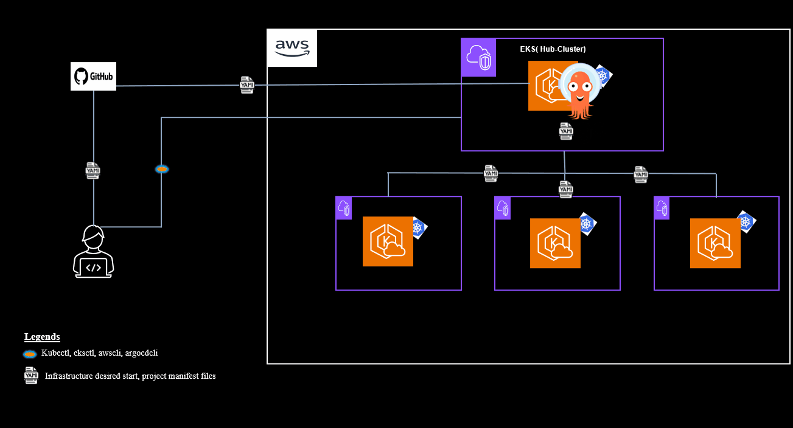
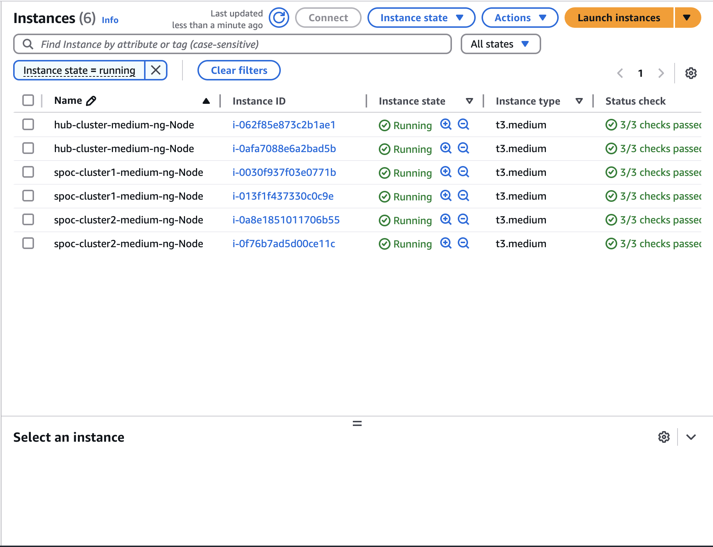
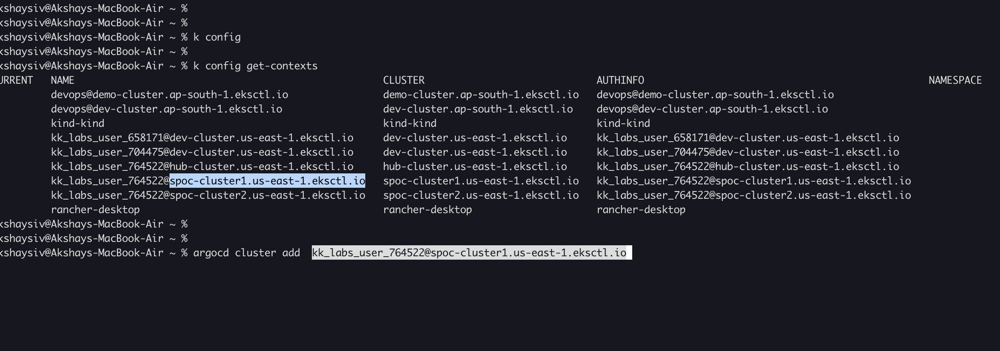
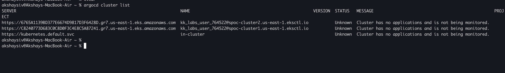
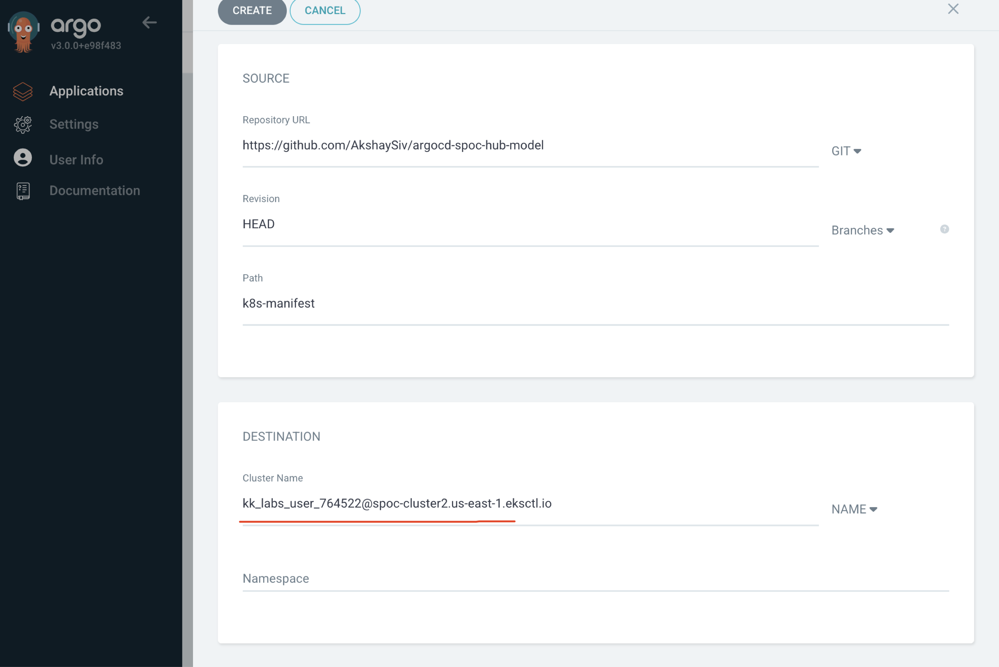
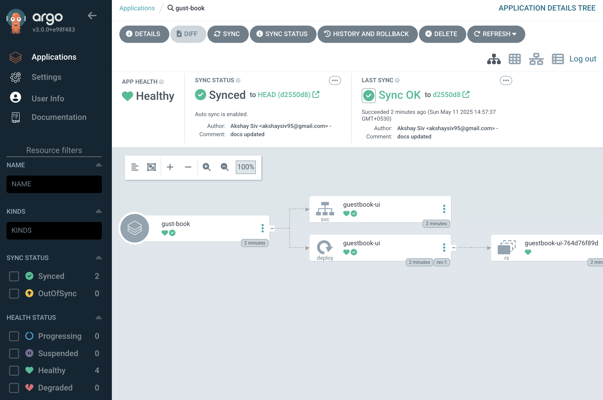

# `argocd-spoc-hub-model`

This repository demonstrates the implementation of a **multi-cluster GitOps deployment model** using **ArgoCD** with a **centralized Single Point of Contact (SPOC) hub architecture**. The architecture involves a **hub cluster** and **two SPOC clusters**, all hosted on **AWS EKS**. This setup enables centralized management of ArgoCD applications across multiple Kubernetes clusters, ensuring streamlined operations, scalability, and visibility.

## Architecture Overview



1. **Hub Cluster (ArgoCD SPOC Hub)**
   - The **hub cluster** acts as the centralized control plane.
   - It runs the **ArgoCD instance**, responsible for managing application deployments and synchronizing changes to the **SPOC clusters**.
   - The hub cluster is the entry point for all administrative tasks, such as managing applications, defining policies, and viewing logs.
   
2. **SPOC Clusters (Single Point of Contact)**
   - The **SPOC clusters** are dedicated Kubernetes clusters that receive the configurations and applications managed by the **hub cluster**.
   - These clusters contain the workloads and services deployed from the hub, with ArgoCD maintaining synchronization between the hub and SPOC clusters.
   - The SPOC clusters can be **multi-region** and **multi-availability zone (AZ)** to ensure high availability and fault tolerance.


### Step 1: Create EKS Clusters

To set up the **hub cluster** and **SPOC clusters**, use the following `eksctl` commands.

```bash
eksctl create cluster -f /Users/akshaysiv/Workspace/github_projects/argocd-spoc-hub-model/eks/hub_cluster.yaml
eksctl create cluster -f /Users/akshaysiv/Workspace/github_projects/argocd-spoc-hub-model/eks/spoc_cluster1.yaml
eksctl create cluster -f /Users/akshaysiv/Workspace/github_projects/argocd-spoc-hub-model/eks/spoc_cluster2.yaml
```

These commands will create the following clusters:
- **Hub Cluster**: Defined in `hub_cluster.yaml`.
- **SPOC Cluster 1**: Defined in `spoc_cluster1.yaml`.
- **SPOC Cluster 2**: Defined in `spoc_cluster2.yaml`.

Make sure to verify the cluster creation process and confirm that all clusters are active before proceeding to the next steps.





#### Install ArgoCD in the Hub Cluster

To install **ArgoCD** in the **hub cluster**, follow these steps:

1. **Add the ArgoCD namespace**:
    ```bash
    kubectl create namespace argocd
    ```

2. **Install ArgoCD using the official manifests**:
    ```bash
    kubectl apply -n argocd -f https://raw.githubusercontent.com/argoproj/argo-cd/stable/manifests/install.yaml
    ```

3. **Verify the installation**:
    Ensure all ArgoCD components are running:
    ```bash
    kubectl get pods -n argocd
    ```

4. **Access the ArgoCD UI**:
    - Expose the ArgoCD server using a LoadBalancer or port-forwarding:
      ```bash
      kubectl port-forward svc/argocd-server -n argocd 8080:443
      ```
    - Access the UI at `https://localhost:8080`.

5. **Retrieve the admin password**:
    ```bash
    kubectl get secret argocd-initial-admin-secret -n argocd -o jsonpath="{.data.password}" | base64 -d
    ```

6. **Login to ArgoCD**:
    Use the username `admin` and the retrieved password to log in.

Once ArgoCD is installed and accessible, you can proceed to configure it for managing applications across the **SPOC clusters**.

#### Add SPOC Clusters to the Hub Cluster

To manage the **SPOC clusters** from the **hub cluster** using ArgoCD, follow these steps:

1. **Install `kubectl` and `argocd` CLI tools**:
    Ensure you have the required CLI tools installed on your local machine:
    ```bash
    brew install argocd
    ```

2. **Add the SPOC clusters to the hub cluster**:
    Use the following commands to add the **SPOC clusters** to the ArgoCD instance running in the **hub cluster**.

    ```bash
    # Login to ArgoCD
    argocd login <ARGOCD_SERVER> --username admin --password <ADMIN_PASSWORD> --insecure

    # Add SPOC Cluster 1
    argocd cluster add spoc-cluster1-context

    # Add SPOC Cluster 2
    argocd cluster add spoc-cluster2-context
    ```

    Replace `<ARGOCD_SERVER>` with the ArgoCD server URL (e.g., `localhost:8080` if port-forwarding is used) and `<ADMIN_PASSWORD>` with the admin password retrieved earlier. Replace `spoc-cluster1-context` and `spoc-cluster2-context` with the respective kubeconfig contexts for the SPOC clusters.

    

3. **Verify the clusters are added**:
    Run the following command to list the clusters managed by ArgoCD:
    ```bash
    argocd cluster list
    ```
    You should see the **hub cluster** and both **SPOC clusters** listed.

    

Once the SPOC clusters are added, you can start deploying applications from the **hub cluster** to the **SPOC clusters** using ArgoCD.




